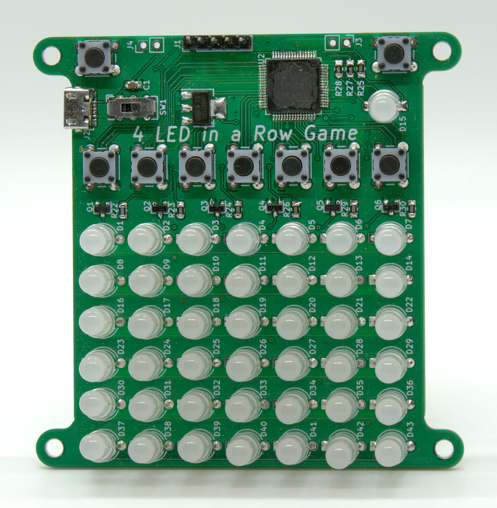
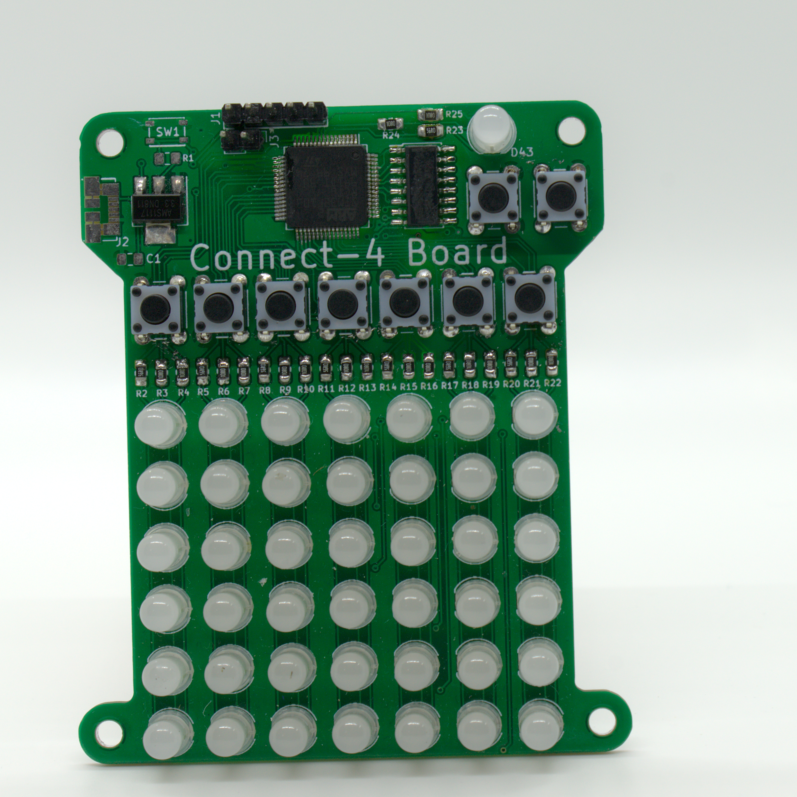

# PCB Digital 4-In-A-Row - ARCHIVED

This a PCB is a soldering kit for a 4-In-A-Row game. This specific repo is archived. Previously I didn't use a version manager, and thus I have difference folders for different revs, while now I want to start using git as a version manager (as well as proper releases and stuff). Thus there is a new clean repo for this project, and this is here for archival purposes. 

The new repo can be found here:
[https://github.com/Electro707/PCB-4-In-A-Row](https://github.com/Electro707/PCB-4-In-A-Row)

Rev A1:

Rev A2:

Latest Rev:

## Authors

* **Jamal Bouajjaj** 

## License

See the [LICENSE.md](LICENSE.md) file for details

## Changelog 

What are those version? Well I have documented them under [CHANGELOG.md](CHANGELOG.md).
